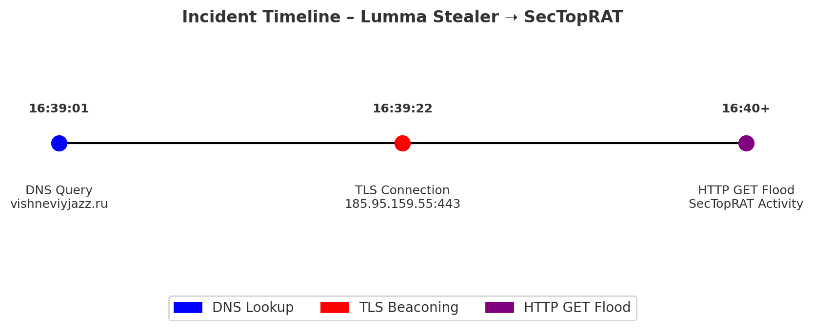
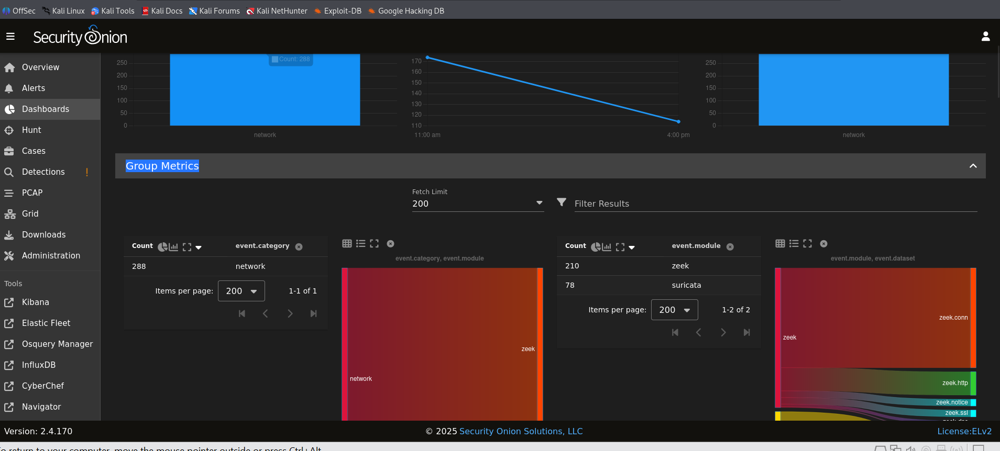
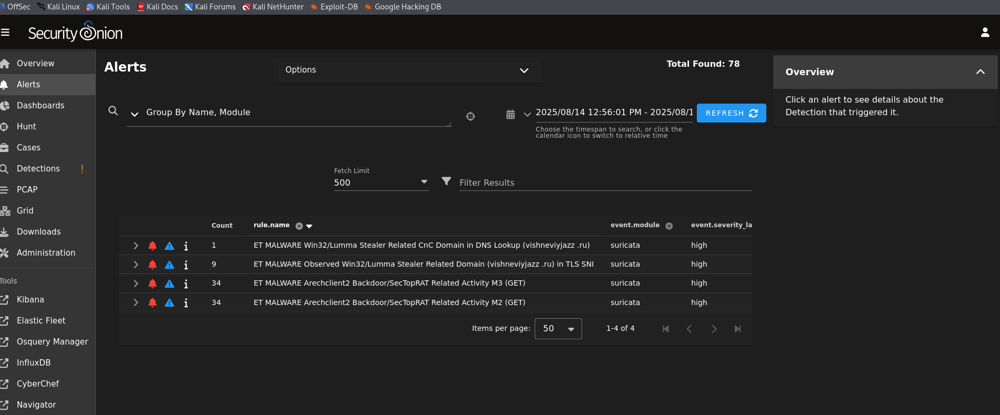
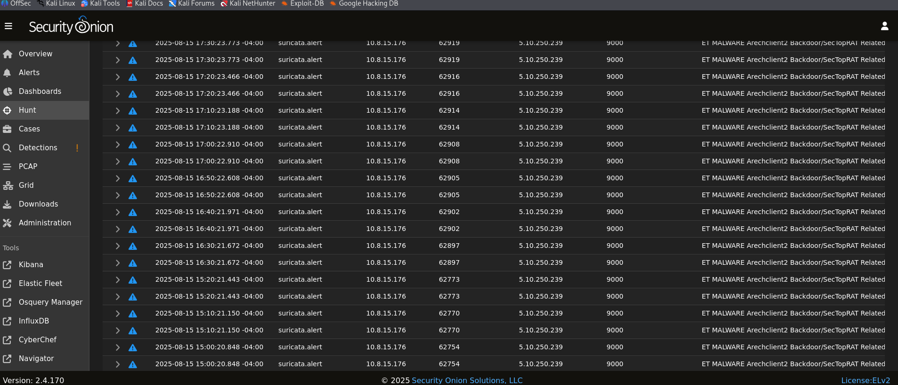

# securityonion-lab-lumma-stealer-sectoprat-8.15
# Security Onion Lab – Lumma Stealer + SecTopRAT

This repo documents my analysis of a malicious PCAP imported into **Security Onion 2**.  
Using Suricata + Zeek, I reconstructed a multi-stage malware infection chain involving **Lumma Stealer** and **SecTopRAT**.

---

## 📌 Incident Timeline

1. **DNS Lookup**  
   - Host `10.8.15.176` → `vishneviyjazz[.]ru`  
   - Suricata Alert: *ET MALWARE Win32/Lumma Stealer CnC Domain in DNS Lookup*

2. **TLS Beaconing**  
   - Same host initiated encrypted comms with `vishneviyjazz[.]ru`  
   - Suricata Alert: *ET MALWARE Lumma Stealer Domain in TLS SNI*

3. **HTTP GET Flood**  
   - 34+ suspicious GETs flagged as **Arechclient2 / SecTopRAT**  
   - Indicates RAT backdoor activity.

---

## 🔎 Key Indicators
- Domain: `vishneviyjazz[.]ru`  
- Historical IP (Zeek DNS log): `185.95.159.55`  
- Host: `10.8.15.176`  

📌 *Lesson learned*: **Threat actors are persistant, there's much more than a single attack**
                     **WHOIS or a DNS lookup today may not match what the domain resolved to during the incident**

---

## 📊 Images

<table>
<tr>
  <td>
    
    
<em>Incident Timeline</em>

  </td>
  <td>
    
    
<em>Security Onion Dashboard</em>

  </td>
</tr>
<tr>
  <td>
    
    
<em>Suricata Alerts (Lumma Stealer &amp; SecTopRAT)</em>

  </td>
  <td>
    
    
<em>Hunt Results (Event Timeline)</em>

  </td>
</tr>
<tr>
  <td colspan="2" align="center">
    
    
<em>WHOIS Lookup (vishneviyjazz.ru)</em>

  </td>
</tr>
</table>

---

## 🛠️ Tools Used

- Security Onion 2  
- Suricata (IDS alerts)  
- Zeek (DNS, TLS, HTTP logs)  
- Hunt App  

---

## ✅ Takeaways

- A single PCAP can reveal a **full attack chain**.  
- Suricata + Zeek = fast detection + validation.  
- Great exercise for SOC / IR skill building.  

---

*PCAP source: [malware-traffic-analysis.net](https://www.malware-traffic-analysis.net/)*

    
