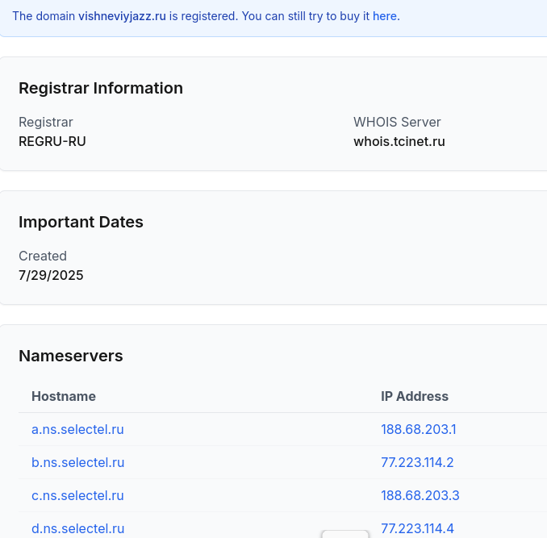

# Security Onion Lab – Lumma Stealer + SecTopRAT

This repo documents my analysis of a malicious PCAP imported into **Security Onion 2**.  
Using Suricata + Zeek, I reconstructed a multi-stage malware infection chain involving **Lumma Stealer** and **SecTopRAT**.

---

## 📌 Incident Timeline

1. **DNS Lookup**  
   - Host `10.8.15.176` → `vishneviyjazz[.]ru`  
   - Suricata Alert: *ET MALWARE Win32/Lumma Stealer CnC Domain in DNS Lookup*

2. **TLS Beaconing**  
   - Same host initiated encrypted comms with `vishneviyjazz[.]ru`  
   - Suricata Alert: *ET MALWARE Lumma Stealer Domain in TLS SNI*

3. **HTTP GET Flood**  
   - 34+ suspicious GETs flagged as **Arechclient2 / SecTopRAT**  
   - Indicates RAT backdoor activity.

---

## 🔎 Key Indicators
- Domain: `vishneviyjazz[.]ru`  
- Historical IP (Zeek DNS log): `185.95.159.55`  
- Host: `10.8.15.176`  

📌 *Lesson learned*: **Threat actors are persistant, there's much more than a single attack**
                     **WHOIS or a DNS lookup today may not match what the domain resolved to during the incident**
                     
🔎 How to Detect Lumma Activity

Detection relies on a mix of network IDS and endpoint telemetry:

DNS Monitoring

Suricata/Zeek rules trigger when a host resolves a known Lumma C2 domain.

Example alert:

ET MALWARE Win32/Lumma Stealer Related CnC Domain in DNS Lookup

TLS SNI Inspection

Even if the traffic is encrypted, the TLS Server Name Indication (SNI) often exposes the domain (vishneviyjazz.ru in this case).

Suricata raises an alert when a client includes this domain in the TLS handshake.

Wireshark can also display the SNI under the TLS handshake details. (Insert your screenshot here →)

Endpoint Behavior

Watch for suspicious process chains (PowerShell, MSIHTA) or access to browser/crypto files.

EDR tools (Sysmon, CrowdStrike, etc.) can flag unusual file access or network beacons.

Emerging Threats (ET) Rulesets

Keep Suricata ET signatures up-to-date; Lumma domains rotate frequently.

Rules map to MITRE ATT&CK: TA0011 (C2), T1071 (Application Layer Protocol).                     

---

## 📊 Images

<table>
<tr>
  <td>
    
    
<em>Incident Timeline</em>

  </td>
  <td>
    
    
<em>Security Onion Dashboard</em>

  </td>
</tr>
<tr>
  <td>
    
    
<em>Suricata Alerts (Lumma Stealer &amp; SecTopRAT)</em>

  </td>
  <td>
    
    
<em>Hunt Results (Event Timeline)</em>

  </td>
</tr>
<tr>
  <td colspan="2" align="center">
    
    
<em>WHOIS Lookup (vishneviyjazz.ru)</em>

  </td>
</tr>
</table>

---

## 🛠️ Tools Used

- Security Onion 2  
- Suricata (IDS alerts)  
- Zeek (DNS, TLS, HTTP logs)  
- Hunt App  

---

## ✅ Takeaways

- A single PCAP can reveal a **full attack chain**.  
- Suricata + Zeek = fast detection + validation.  
- Great exercise for SOC / IR skill building.  

---

*PCAP source: [malware-traffic-analysis.net](https://www.malware-traffic-analysis.net/)*

## 📊 Evidence Gallery

### Incident Timeline

### Security Onion Dashboard

### Suricata Alerts (Lumma Stealer & SecTopRAT)

### Hunt Results (Event Timeline)

### WHOIS Lookup (vishneviyjazz.ru)

    
